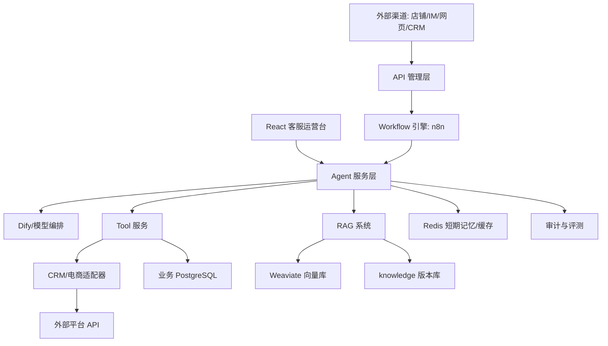

# 系统架构

## 当前定位

项目当前是 AI 客服技术 MVP，已经具备本地可运行的 Dify、n8n、业务库、Redis、Weaviate、模拟 Tool 服务。下一阶段目标是演进为标准的 AI 客服平台架构。

## 当前运行链路

当前本地链路是：React 运营台或 n8n webhook 调用 `agent-service`；服务先使用本地策略、训练主题、订单模拟 Tool、RAG 和审计。仅当目标环境显式配置并启用 Dify App 时，才会将普通问答转交给已发布的 Dify Chatflow。真实电商渠道、API 网关与 Adapter 尚未接入。

## 目标架构（并非全部已实现）

## 目录边界

- `services/`：业务服务和 Tool 服务。当前包含 `db-simulator`、`agent-service` 和独立部署的 React `support-console`；后续增加 `api-gateway`、`crm-adapter`、`commerce-adapter`。
- `adapters/`：外部平台适配器，负责把店铺/CRM 的字段转换成内部统一模型。
- `workflows/`：n8n 工作流导出与说明。
- `prompts/`：Prompt 工程资产。
- `knowledge/`：知识库原始资料。
- `specs/`：Agent、Tool、Workflow、API、Adapter、RAG、Monitoring 的机器可读规格。
- `deployment/`：Docker Compose 和部署配置。
- `docs/`：架构、运维、安全、数据治理文档。

## 数据边界

- Dify PostgreSQL：只保存 Dify 平台自身数据。
- Business PostgreSQL：保存业务事实、客服会话、memory、context、审计和知识版本元数据。
- Redis：保存短期记忆、缓存、限流状态、任务中间状态。
- Weaviate：保存 RAG 向量数据。
- n8n 存储：保存 workflow 和执行数据，正式环境建议切换 PostgreSQL。

## 服务边界

- Workflow 只编排，不沉淀复杂业务逻辑。
- Agent 服务层负责编排模型、记忆、上下文、RAG、Tool、策略与审计；`agent-service` 还提供客服工作台的领取、模拟发送、工单、解决和训练主题/素材/版本接口。`support-console` 只呈现与调用这些受控接口，浏览器 CORS 仅允许本地控制台来源。
- Tool 服务提供 AI 可调用的受控能力。
- Adapter 层负责平台差异，不让平台字段污染核心业务模型。
- API 管理层统一鉴权、限流、幂等、日志、版本和错误码。

当前实现状态和已知 RAG 限制以 [当前项目状态](CURRENT_STATUS.md) 为准；本页中的 API Gateway、CRM/电商 Adapter 和外部渠道节点是目标架构，不应表述为已上线能力。
# 轻量向量检索实现

`agent-service` 使用 FastEmbed ONNX 将 `knowledge/` 的 `.md`/`.txt` 切片编码为 512 维向量；Business PostgreSQL 保存文档、版本、切片与同步任务，Weaviate 保存向量。订单、物流、支付、库存等实时事实不进入向量库，仍由 Tool 查询。

同步任务会拒绝包含手机号、身份证号、完整地址或订单号的资料。检索结果持久化到会话上下文快照，包含资料来源、文档版本、切片和检索模式，便于审计。
