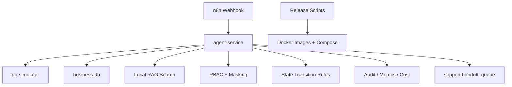

# Local Productization Closure Design

## 目标

把当前 AI 客服项目从“本地工程化 MVP 底座”推进到“本地可验证的产品化闭环”。本轮只补齐不依赖真实电商/CRM API 的能力；真实店铺 API、真实 CRM 登录态、真实客服组织数据继续保留为适配器边界和模拟链路。

## 范围

本轮补齐这些未闭环项：

1. n8n workflow 资产：提供可导入的本地 workflow JSON，流程为 webhook -> agent-service -> response。
2. RAG 本地链路：提供本地知识检索接口，使用 `knowledge/` 文件和数据库 context 持久化，不做真实 embedding 依赖。
3. 权限与脱敏执行层：在 agent-service 增加角色权限预览与统一脱敏策略，不把策略只停留在数据库表。
4. Tool 超时与降级：读取或内置工具超时策略，失败时返回转人工或缓存说明。
5. 转人工最小闭环：Agent 判断需要转人工时写入 `support.handoff_queue`，并提供队列查询/处理接口。
6. 监控、成本与评测：扩展 `/metrics`、写入 cost events，补本地验证脚本。
7. 状态机最小执行层：提供会话、转人工、评测、发布的状态流转规则预览，不引入重型状态机框架。
8. Docker release 打包部署：把前一份方案落成脚本和 release compose overlay。

## 非目标

- 不接入真实淘宝、抖店、飞书、企业微信或 CRM API。
- 不修改 `platform/` 中的 Dify、n8n 或其他开源平台源码。
- 不把复杂业务逻辑放进 `workflows/`。
- 不引入 Kubernetes、云 Secret Manager、Prometheus/Grafana 等重型依赖。
- 不把 API Key、密码或真实数据打包进 release 包。

## 架构

agent-service 是本轮执行层中心。n8n 只负责流程编排；RAG、权限、状态、降级和转人工判断都在 agent-service 内以最小服务边界实现，并写入现有 business-db 表。

## 组件设计

### Workflow

新增 `workflows/n8n-customer-support-local.json`，可导入 n8n。它接收客服消息，调用 `http://agent-service:8010/api/agent/reply`，把 Agent 回复作为 webhook response 返回。

### RAG

新增 `/api/rag/search`。检索范围是 `knowledge/` 下的 Markdown/Text 文件，采用本地关键词匹配。该链路用于证明“知识检索 -> retrieval_context -> context snapshot”闭环，不声称具备生产 embedding 质量。

### 权限与脱敏

新增 `/api/security/access-preview`，基于角色返回可访问资源、允许动作和脱敏字段。Agent 回复中的订单、手机号、地址默认脱敏；只有 `pii.read_full` 角色才能看到原始 PII。当前不做真实登录态，只接收 `role` 或 `permissions` 作为模拟输入。

### Tool 降级

订单 Tool 失败时写 audit log、metrics 和 handoff queue。对 `get_order` 使用本地策略：默认超时 5 秒，失败后转人工；后续可替换为数据库读取 `ops.tool_fallback_policies`。

### 转人工

新增 repository 写入 `support.handoff_queue`。新增 `/api/workbench/handoffs` 查询待处理转人工队列，新增 `/api/workbench/handoffs/{id}/resolve` 关闭队列项。它是后续前端客服台的 API 基础。

### 状态机

新增 `services/agent-service/state_machine.py` 和 `/api/state/transition-preview`。先覆盖 conversation、handoff、evaluation、rollout 四类对象的合法流转。接口只做预览，不直接改数据库，避免无业务上下文时误改状态。

### 监控、成本与评测

`/metrics` 返回结构化指标清单。Agent 每次回复写 `audit.metrics_events` 和 `audit.cost_usage_events`。新增验证脚本检查 metrics、cost、handoff、rag、state API。

### Docker Release

新增 release compose overlay、package/install/backup/restore 脚本和静态 package 验证脚本。目标是支持把镜像 tar 包和部署文件复制到另一台装有 Docker Desktop 的电脑运行。

## 验收标准

1. `scripts/verify.ps1 -EnvFile deployment/env/local.env` 通过。
2. `tests/services/verify_agent_service.ps1` 覆盖 Agent、RAG、权限、状态、转人工、成本事件。
3. `tests/deployment/verify_release_package.ps1` 能校验 release 包结构。
4. n8n workflow JSON 文件存在且包含 webhook、HTTP request、respond 节点。
5. 所有新增代码只在 `services/`、`deployment/`、`scripts/`、`tests/`、`docs/`、`workflows/` 内。

## 回滚

- 代码文件回滚：删除本轮新增文件，恢复修改过的 `agent-service` 文件。
- 数据回滚：本轮不新增数据库迁移；只写入测试数据和审计数据，可通过 Docker volume 重建或数据库备份恢复。
- 部署回滚：使用原 `deployment/docker-compose.yml`，不加载 release overlay。
