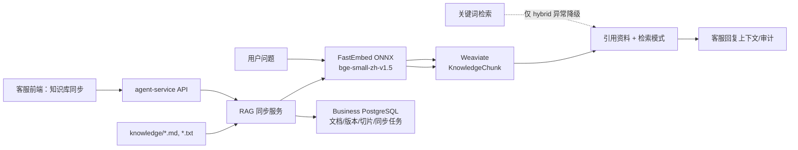

# 轻量本地向量 RAG 设计

## 1. 目的与范围

将当前 `agent-service` 中仅用于离线验证的关键词知识检索升级为可在 Docker Compose 中运行的本地向量检索闭环。该变更只覆盖 `knowledge/` 下的 Markdown 与文本资料，不改变订单、物流、库存和支付状态必须由 Tool 或外部平台查询的事实边界。

本次交付必须同时满足：

1. 以 `BAAI/bge-small-zh-v1.5` 生成中文文本向量；
2. 使用已有 Weaviate 容器持久化向量；
3. 使用已有 Business PostgreSQL 的 `knowledge.documents`、`knowledge.document_versions`、`knowledge.document_chunks` 与 `knowledge.sync_jobs` 记录来源、版本、切片和同步过程；
4. 在无网络、模型下载失败或 Weaviate 不可用时，安全降级为当前关键词检索，并明确暴露降级状态；
5. 支持从客服前端发起同步并查看同步结果；
6. Docker 重启后复用已下载模型和已入库向量，不重复下载模型。

不在本次范围内：Dify Chatflow 发布、远程模型提供商、图片/视频语义理解、reranker、真实电商平台 Adapter，以及将任何实时订单事实写入向量库。

## 2. 已确认的技术决策

### 2.1 模型与运行时

使用 `BAAI/bge-small-zh-v1.5`，通过 `fastembed` 的 ONNX CPU 推理运行，而不是安装 PyTorch 与 Sentence Transformers。模型向量维度固定为 512；模型文件写入独立 Docker 卷 `embedding_model_cache`，路径为 `/models`。

选择 ONNX 的原因是模型缓存约 90 MB，CPU 可运行且不会引入 PyTorch 带来的大镜像和内存开销。GPU 不属于本次运行前提。

### 2.2 检索模式与降级规则

新增以下环境变量，并在 `deployment/env/local.env.example` 中列出：

| 变量 | 默认值 | 含义 |
| --- | --- | --- |
| `RAG_MODE` | `hybrid` | `vector` 只接受向量结果；`hybrid` 向量不可用时回退关键词；`keyword` 禁用模型与 Weaviate。 |
| `RAG_EMBEDDING_MODEL` | `BAAI/bge-small-zh-v1.5` | 固定的嵌入模型名。 |
| `RAG_MODEL_CACHE_PATH` | `/models` | 模型缓存目录。 |
| `WEAVIATE_URL` | `http://weaviate:8080` | Weaviate 内网地址。 |
| `RAG_AUTO_INDEX` | `true` | Compose 启动后是否执行一次增量同步。 |

正常路径：查询向量化 -> Weaviate `nearVector` 检索 -> 返回切片、来源、版本、距离和 `retrieval_mode=vector`。

降级路径：模型缓存不存在且下载失败、Weaviate 不健康、集合不存在或索引尚未成功时，`hybrid` 模式调用既有关键词实现 -> 返回 `retrieval_mode=keyword_fallback` 与机器可读的 `fallback_reason`。`vector` 模式不返回伪造的关键词结果，而是返回可诊断的服务错误；`keyword` 模式不加载模型。

## 3. 组件与数据流

### 3.1 资料同步

同步任务按以下顺序执行：

1. 扫描 `knowledge/` 中允许的 `.md` 和 `.txt` 文件，拒绝符号链接与超出知识根目录的路径；
2. 计算 UTF-8 文本 SHA-256，建立或更新文档记录；内容哈希不变时跳过向量重算；
3. 以固定的 800 字符窗口、120 字符重叠切片，保存切片序号、原文和文档版本；
4. 使用 FastEmbed 批量生成 512 维向量；
5. 在 Weaviate 创建或复用 `KnowledgeChunk` 集合，并显式写入向量、文档版本 ID、切片 ID、来源 URI、标题和内容；
6. 仅在向量写入成功后标记数据库切片的 `embedding_ref`，并将同步任务标记为 `succeeded`；任一步骤失败时记录 `failed`、错误摘要和完成时间；
7. 删除来源文件已不存在或版本已过期的 Weaviate 对象，确保结果只来自当前发布资料。

本地知识文件不得含手机号、详细地址、订单号或身份证等个人信息。同步接口在发现受限制字段时拒绝同步并写审计事件。

### 3.2 查询与审计

`search_knowledge(query, limit)` 保持现有调用方兼容，返回项新增：`document_version_id`、`chunk_id`、`distance`、`retrieval_mode` 与可选 `fallback_reason`。结果继续写入 `memory.context_snapshots`，因此客服回复可以追溯到具体知识版本和切片。

`POST /api/rag/search` 响应增加全局 `retrieval_mode` 和 `index_status`。新增受控的 `POST /api/rag/reindex`，只允许客服运营角色调用，返回 `sync_job_id`；新增 `GET /api/rag/status`，返回模型是否已缓存、Weaviate 连通性、最后一次同步任务、文档/切片计数及当前检索模式。

### 3.3 前端闭环

在已有 AI 训练中心增加“知识库同步”卡片，显示：当前模式、模型名、模型缓存状态、Weaviate 状态、最近同步时间、文档数、切片数、失败原因和“立即同步”按钮。按钮调用 `POST /api/rag/reindex`，轮询 `GET /api/rag/status` 至成功或失败；加载中禁用重复提交，失败时保留可读错误和重试入口。

客服会话页不改变人工接管规则；检索结果只作为 AI 建议与审计上下文，不能覆盖实时 Tool 的订单、物流、支付和库存结果。

## 4. 部署设计

`agent-service` 增加 FastEmbed 依赖，并继续使用现有 `httpx` 调用 Weaviate REST/GraphQL API，避免引入版本耦合的 Weaviate SDK。Docker Compose 增加 `embedding_model_cache` 卷并挂载到 `agent-service`；Weaviate 继续使用已有 `weaviate_data` 卷。

Compose 启动后，`agent-service` 保持健康检查可用；自动索引失败不能导致服务健康检查失败。首次请求或前端同步会触发模型下载。下载期间状态接口显示 `downloading`，而非误报索引成功。

默认 `hybrid` 模式是新环境的安全默认值：既能自动获得真实向量检索，也能在受限网络、离线演示或依赖故障时维持现有闭环。生产环境在索引成功并完成验收后可改为 `RAG_MODE=vector`，以禁止关键词降级掩盖故障。

## 5. 错误处理与安全

1. 模型下载与初始化异常不泄露访问令牌、服务器路径或完整依赖堆栈给前端；详细诊断仅写服务日志与同步任务错误摘要。
2. 查询为空、`limit` 超出 1 至 10、向量维度不为 512 或 Weaviate 返回异常结构时，接口返回受控 4xx/5xx 响应。
3. Weaviate 写入以稳定的 `chunk_id` 去重；重复同步不产生重复向量。
4. `reindex` 同时只允许一个活动任务；重复请求返回现有 `sync_job_id`。
5. 资料在向量化前执行 PII 检查；拒绝项不进入 Weaviate。

## 6. 验收与测试

### 6.1 自动化测试

1. 单元测试先验证：切片窗口与重叠、内容哈希跳过、限制路径、向量维度验证、关键词降级标识和单活动同步任务。
2. 使用 FastEmbed/Weaviate 边界的可替换客户端，测试向量查询在“催物流”与“物流什么时候到”这类不同措辞下返回同一知识来源。
3. API 测试覆盖 `/api/rag/search`、`/api/rag/reindex`、`/api/rag/status` 的成功、模型不可用、Weaviate 不可用和权限拒绝路径。
4. 前端测试覆盖同步按钮的加载、成功、失败、重试与禁用状态。

### 6.2 Compose 验证

1. 从空 Docker 卷启动，模型只下载一次，状态接口由 `downloading` 变为 `ready`；
2. 执行同步后，PostgreSQL 有文档、版本、切片与成功任务记录，Weaviate 有等量去重向量；
3. 对同义问句调用 RAG API，`retrieval_mode=vector` 且结果包含来源、版本、切片和距离；
4. 暂停 Weaviate 后，`RAG_MODE=hybrid` 返回 `keyword_fallback`；`RAG_MODE=vector` 返回明确错误；
5. 执行 `scripts/verify.ps1`、Docker Compose 配置校验及核心 HTTP 健康接口，全部通过。

## 7. 非目标与后续演进

本次不下载或运行聊天大模型；Dify/远程模型继续负责未来的自然语言生成。下一阶段可在真实评测集完成后，再评估 `bge-m3`、稀疏检索与 reranker。切换模型必须创建新集合或重建全部向量，不得混用不同维度的向量。
